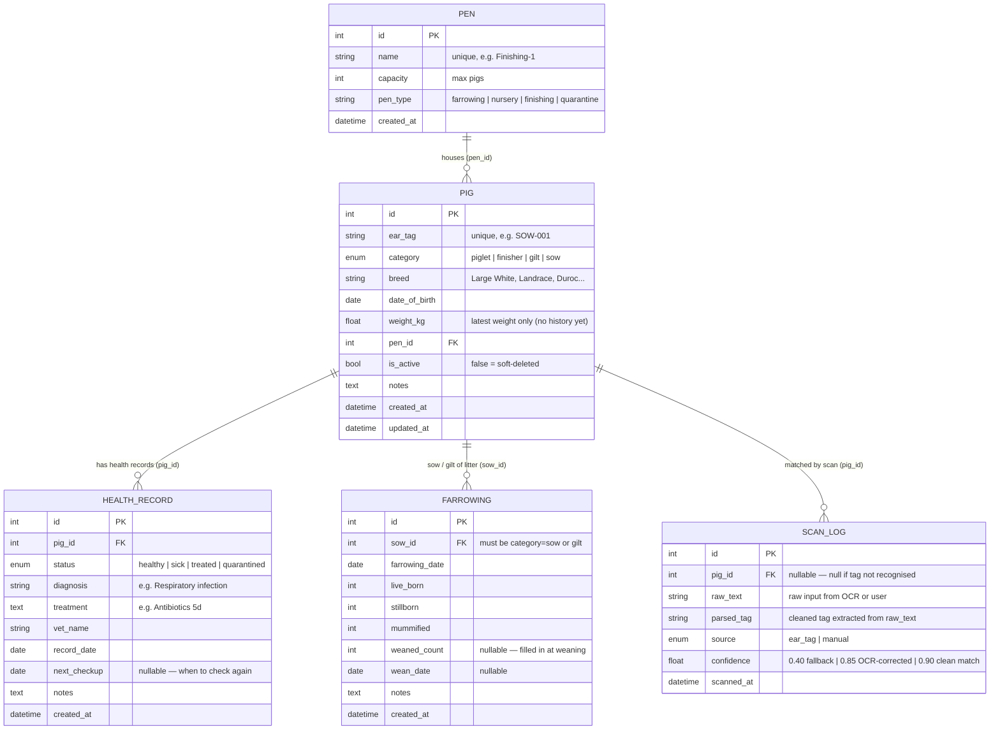
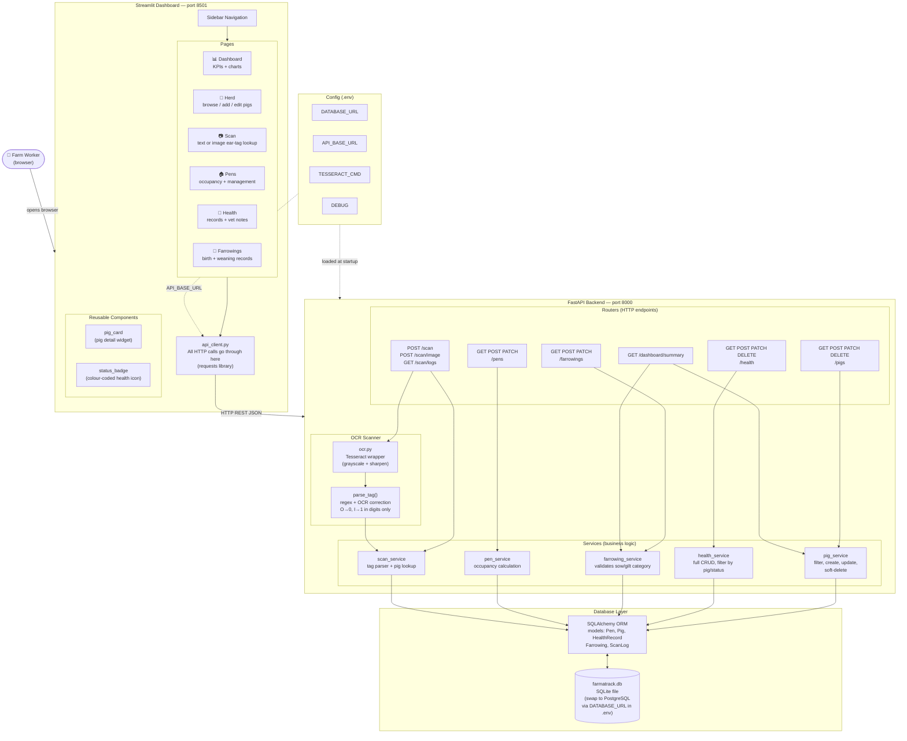
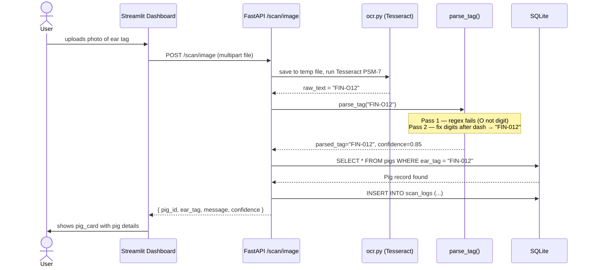

# FarmaTrack — Diagrams

> **How to view:** Open this file in VS Code with the "Markdown Preview Mermaid Support" extension,
> or paste any diagram block into **https://mermaid.live**

---

## 1. Database ER Diagram



---

## 2. Architecture Diagram



---

## 3. Request Flow — Example: Scanning an Ear Tag from Image



---

## 4. Data Relationships at a Glance

```
PEN
 └── PIGS  (many pigs per pen, one pen per pig)
      ├── HEALTH_RECORDS  (many per pig, hard delete allowed)
      ├── FARROWINGS      (many per sow/gilt, no delete)
      └── SCAN_LOGS       (many per pig, or orphan if tag not found)
```

**Key rules baked into the code:**
- A pig's `ear_tag` must be globally unique
- `DELETE /pigs/{id}` is a **soft delete** — sets `is_active=false`, keeps all history
- A `FARROWING` can only be created for a pig with `category = sow` or `gilt`
- A `HEALTH_RECORD` requires a valid `pig_id` (validated in service layer)
- `SCAN_LOG.pig_id` is **nullable** — unmatched scans are still recorded

**Enums (change these in `database/enums.py`):**
```
PigCategory  →  piglet | finisher | gilt | sow
HealthStatus →  healthy | sick | treated | quarantined
ScanSource   →  ear_tag | manual
```
